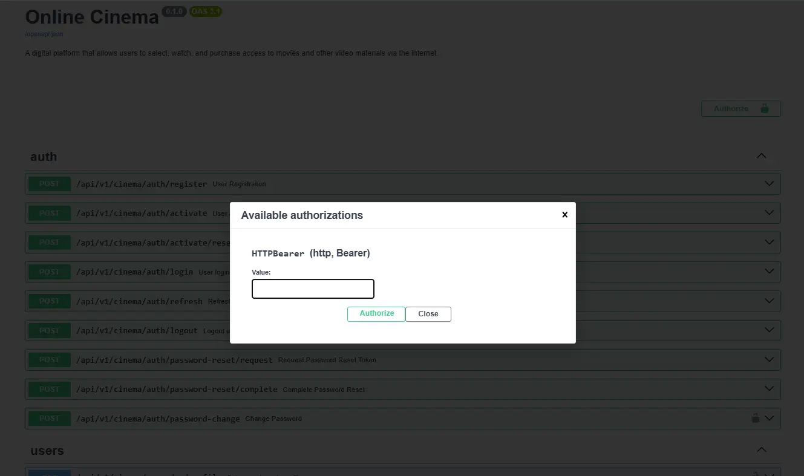
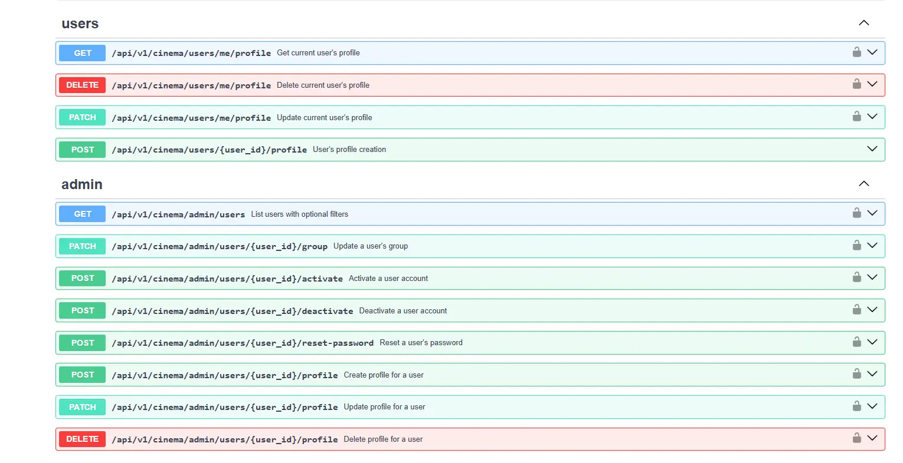
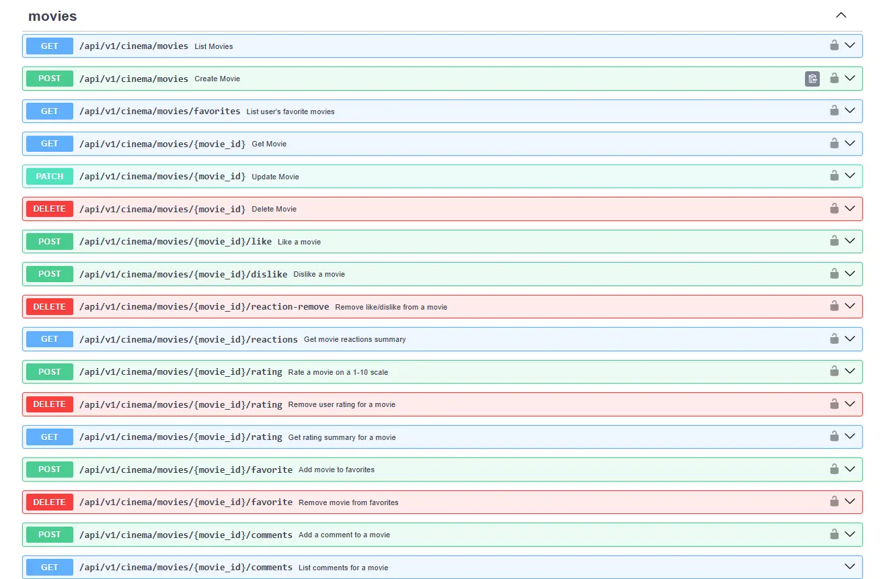
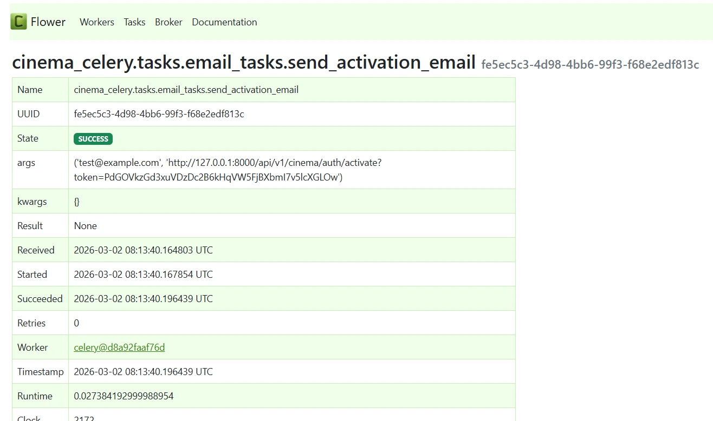
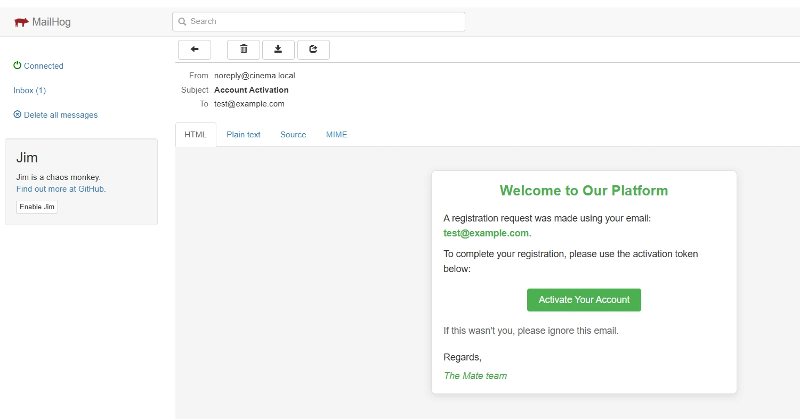
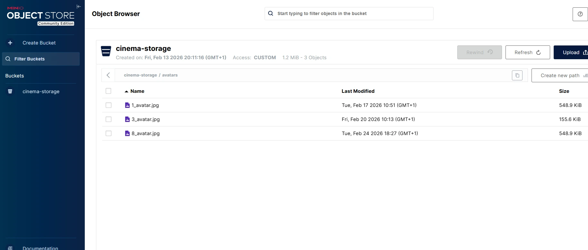

# Online Cinema API

> Production-grade async REST API backend for a digital video platform. An online cinema is a platform where users can browse, watch, and purchase access to movies and video content over the internet. The project implements a complete **movie catalog, interaction layer, and HLS video streaming pipeline** — from raw upload through FFmpeg transcoding to adaptive-bitrate playback in any HLS-capable browser. Development is ongoing; upcoming milestones include CD pipeline, deployment automation, and expanded test coverage.

[](https://github.com/dkibalenko/online-cinema-fastapi/actions/workflows/ci.yml)
[](https://codecov.io/gh/dkibalenko/online-cinema-fastapi)


---

## Demo

<table>
  <tr>
    <td align="center">
      <a href="https://youtu.be/y59jlSmeKQQ">
        
      </a><br>
      <strong>HLS video streaming</strong>
    </td>
    <td align="center">
      <a href="https://youtu.be/-01bDbUgVlo">
        
      </a><br>
      <strong>Load test (500 users, Locust)</strong>
    </td>
  </tr>
</table>

**Screenshots:**

<table>
  <tr>
    <td><a href="docs/cinema-auth.webp"></a></td>
    <td><a href="docs/cinema-api-1.webp"></a></td>
    <td><a href="docs/cinema-api-2.webp"></a></td>
  </tr>
  <tr>
    <td align="center">Swagger Auth</td>
    <td align="center">API Endpoints</td>
    <td align="center">Movie Interactions</td>
  </tr>
  <tr>
    <td><a href="docs/cinema-flower.webp"></a></td>
    <td><a href="docs/cinema-mailhog.webp"></a></td>
    <td><a href="docs/cinema-minio.webp"></a></td>
  </tr>
  <tr>
    <td align="center">Flower (Celery)</td>
    <td align="center">MailHog</td>
    <td align="center">MinIO</td>
  </tr>
</table>

---

## Features

- **JWT authentication** — short-lived JWT access tokens + opaque DB-backed refresh tokens with rotation on every refresh, activation, password reset, RBAC
- **User management** — profiles, avatar upload (S3/MinIO), admin console with filtering and pagination
- **Movie catalog** — genres, directors, stars, certifications; full-text search, filtering, sorting, pagination
- **Interactions** — atomic upsert likes/dislikes, 1–10 ratings, favorites (with full catalog filtering)
- **Threaded comments** — nested replies, email notifications via Celery, real-time WebSocket push
- **Redis caching** — response cache with targeted per-key invalidation using non-blocking `scan_iter`
- **WebSockets** — JWT-authenticated connections, multi-tab support, stale connection cleanup
- **NGINX** — SSL/TLS 1.2/1.3, WebSocket upgrade, GET response caching, HTTP→HTTPS redirect
- **External service integrations** — async adapter clients for S3-compatible object storage (MinIO/aioboto3, avatar upload/delete) and SMTP email delivery (aiosmtplib); name data seeded via randomuser.me HTTP API (httpx); all clients implement interface contracts for DI and isolated unit testing
- **Database seeding** — idempotent async seeder with auto-generated JSON fixtures
- **Load tested** — 500 concurrent users, 60k requests, 0 failures at ~130 RPS (Locust)
- **HLS video streaming** — Admin/Moderator uploads a raw MP4; Celery worker transcodes to 360p + 720p HLS variants via FFmpeg; segments and playlists are stored in MinIO; authenticated users stream via a `302` redirect to the master playlist; any HLS player (hls.js, Safari native) works out of the box
- **CI pipeline** — GitHub Actions: Ruff linting, mypy type checking, pytest with coverage, Codecov reporting on every push

---

## Architecture

The backend is a **modular monolith** — one deployable unit with clean domain boundaries: `auth`, `users`, `movies`, `notifications`, `cache`, `storages`. Each domain owns its router, service, repository, models, and schemas.

```
                           ┌───────────────────────────┐
                           │        Frontend SPA       │
                           │  (React / Vue / Next.js)  │
                           └─────────────┬─────────────┘
                                         │ HTTPS
                                         ▼
                    ┌────────────────────────────────────────────┐
                    │        NGINX Reverse Proxy                 │
                    │  SSL termination / routing / CORS          │
                    │  WebSocket upgrades / Static file delivery │
                    └────────────────────┬───────────────────────┘
                                         │
                                         ▼
             ┌─────────────────────────────────────────────────────────┐
             │                    FastAPI API                          │
             │  • Auth / Users / Movies / Comments / Favorites         │
             │  • Pydantic v2 validation + dependency injection        │
             │  • WebSocket endpoints (live notifications)             │
             │  • Background task dispatch (Celery)                    │
             └──────────────┬────────────────────────┬─────────────────┘
                            │                        │
                            ▼                        ▼
     ┌────────────────────────────┐   ┌──────────────────────────────────┐
     │       PostgreSQL           │   │           Redis                  │
     │  • Primary data store      │   │  • Response cache                │
     │  • Transactional integrity │   │  • Celery broker + backend       │
     └──────────────┬─────────────┘   └────────────────┬─────────────────┘
                    │                                  │
                    ▼                                  ▼
     ┌────────────────────────────┐   ┌──────────────────────────────────┐
     │      Celery Workers        │   │        MinIO (S3)                │
     │  • Email sending           │   │  • User avatars + media          │
     │  • Scheduled cleanup jobs  │   │  • Async upload/retrieval        │
     └────────────────────────────┘   └──────────────────────────────────┘
```

Key design decisions:
- **Repository pattern** — SQL stays out of the service layer; services coordinate, repositories query
- **Async-first** — `asyncpg` driver, `AsyncSession`, async Redis and S3 clients throughout
- **Atomic UPSERTs** — `INSERT ... ON CONFLICT DO UPDATE` for likes, ratings, and favorites eliminates race conditions
- **Token revocation** — opaque refresh tokens stored in DB allow server-side session invalidation, unlike pure JWT
- **Cache invalidation** — per-key pattern invalidation via `scan_iter` (non-blocking); no full cache wipes

---

## Tech Stack

| Layer | Technology |
|---|---|
| **Framework** | FastAPI, Pydantic v2, Uvicorn |
| **ORM / DB** | SQLAlchemy 2.0 (async), PostgreSQL 16, Alembic |
| **Caching** | Redis (async, `scan_iter`-based invalidation) |
| **Background tasks** | Celery, Celery Beat, Flower |
| **Video** | FFmpeg (HLS transcoding), hls.js (browser player) |
| **Storage** | MinIO (S3-compatible), aioboto3 |
| **Email** | aiosmtplib, Jinja2 templates, MailHog (dev) |
| **Proxy** | NGINX (TLS 1.2/1.3, WebSocket, caching) |
| **Testing** | pytest-asyncio, httpx, factory_boy, Faker, moto |
| **Tooling** | Poetry, Ruff, mypy, pre-commit |
| **Infrastructure** | Docker Compose, GitHub Actions, Codecov |

---

## Project Structure

```
online-cinema-fastapi/
├── src/
│   ├── auth/              # JWT auth, tokens, RBAC
│   ├── users/
│   │   ├── admin/         # Admin console (users, profiles, groups)
│   │   └── ...            # Self-service user endpoints
│   ├── movies/
│   │   ├── routers/       # CRUD, interactions, genres, video endpoints
│   │   ├── services/      # MovieService, VideoService, reactions, comments, cache
│   │   └── ...            # Models, schemas, repositories
│   ├── notifications/     # WebSocket connection manager
│   ├── cache/             # Redis CacheService
│   ├── storages/          # S3/MinIO client
│   ├── cinema_celery/     # Celery app + tasks
│   ├── seeding/           # DB seeder + fixture generator
│   ├── config.py          # Pydantic Settings
│   ├── database.py        # SQLAlchemy engine + session
│   └── main.py            # App factory + router registration
├── tests/
│   ├── unit/
│   ├── integration/
│   └── functional/
├── alembic/               # Migrations
├── docker/                # Dockerfiles + docker-compose.yml
├── nginx/                 # nginx.conf + site.conf
├── load_tests/            # Locust scenarios
├── commands/              # Container startup scripts
├── scripts/               # player.html (HLS smoke-test player), smoke_test_video.sh
├── docs/                  # ERD, architecture diagrams
├── makefile
├── pyproject.toml
└── .env.sample
```

---

## Quick Start (Docker)

**Prerequisites:** Docker, Docker Compose, `make`

```shell
git clone https://github.com/dkibalenko/online-cinema-fastapi.git
cd online-cinema-fastapi
cp .env.sample .env   # fill in required values (see Environment Variables)
make dev-up
```

The stack starts all services, runs Alembic migrations, and seeds the database automatically.

| Command | Effect |
|---|---|
| `make dev-up` | Build images and start all services (detached) |
| `make dev-down` | Stop and remove containers |
| `make dev-logs` | Tail all service logs |
| `make dev-shell` | Open a bash shell in the `web` container |

**Access points:**

| Interface | URL |
|---|---|
| Swagger UI | `https://localhost:8443/docs` |
| API base | `https://localhost:8443/api/v1/cinema/` |
| WebSocket | `wss://localhost:8443/api/v1/cinema/ws/comments?token=JWT` |
| MailHog UI | `http://localhost:8025` |
| Flower | `http://localhost:5555` |
| PgAdmin | `http://localhost:3333` |

> The stack uses a self-signed TLS certificate. In Chrome/Edge: **Advanced → Proceed to localhost**. In Firefox: **Advanced → Accept the Risk and Continue**.

---

## Local Development

**Prerequisites:** Python 3.12, Poetry, a running PostgreSQL + Redis instance.

```shell
poetry install --with dev
cp .env.sample .env   # set POSTGRES_HOST=localhost, etc.
poetry run alembic -c alembic.local.ini upgrade head
cd src && poetry run uvicorn main:app --reload
```

**Generate a migration:**
```shell
poetry run alembic -c alembic.local.ini revision --autogenerate -m "describe change"
```

Docker applies migrations automatically on `make dev-up` — never autogenerates inside the container.

---

## Environment Variables

| Variable | Description | Example |
|---|---|---|
| `POSTGRES_USER` | DB username | `cinema_user` |
| `POSTGRES_PASSWORD` | DB password | `secret` |
| `POSTGRES_DB` | DB name | `cinema_db` |
| `POSTGRES_HOST` | DB host | `db` (Docker) / `localhost` (local) |
| `POSTGRES_DB_PORT` | DB port | `5432` |
| `JWT_SECRET_KEY_ACCESS` | HMAC secret for access tokens | random string |
| `JWT_SECRET_KEY_REFRESH` | HMAC secret for refresh tokens | random string |
| `JWT_SIGNING_ALGORITHM` | JWT algorithm | `HS256` |
| `CELERY_BROKER_URL` | Redis URL for Celery | `redis://redis:6379/0` |
| `CELERY_RESULT_BACKEND` | Redis URL for task results | `redis://redis:6379/0` |
| `SMTP_SERVER` | SMTP host | `cinema-mailhog` |
| `SMTP_PORT` | SMTP port | `1025` |
| `SMTP_USE_TLS` | Enable STARTTLS | `false` (MailHog) |
| `SMTP_USERNAME` | SMTP username | *(empty for MailHog)* |
| `SMTP_PASSWORD` | SMTP password | *(empty for MailHog)* |
| `MAILHOG_USER` | MailHog web UI username | `admin` |
| `MAILHOG_PASSWORD` | MailHog web UI password | `secret` |
| `S3_STORAGE_HOST` | MinIO hostname | `cinema-minio` |
| `S3_STORAGE_PORT` | MinIO port | `9000` |
| `S3_STORAGE_ACCESS_KEY` | MinIO access key | `minioadmin` |
| `S3_STORAGE_SECRET_KEY` | MinIO secret key | `some_password` |
| `S3_BUCKET_NAME` | S3 bucket name | `cinema-media` |
| `S3_PUBLIC_HOST` | Browser-reachable MinIO hostname for HLS redirect URLs | `localhost` |
| `PGADMIN_DEFAULT_EMAIL` | PgAdmin login | `admin@admin.com` |
| `PGADMIN_DEFAULT_PASSWORD` | PgAdmin password | `secret` |
| `SQL_ECHO` | SQLAlchemy query logging | `false` |

---

## API Reference

Base path: `/api/v1/cinema`

All protected endpoints require `Authorization: Bearer <access_token>`.

### Auth `/auth`

| Method | Path | Description | Auth |
|---|---|---|---|
| `POST` | `/register` | Register a new user | — |
| `POST` | `/activate` | Activate account via token | — |
| `POST` | `/activate/resend` | Resend activation email | — |
| `POST` | `/login` | Login, returns access + refresh tokens | — |
| `POST` | `/refresh` | Rotate refresh token | — |
| `POST` | `/logout` | Invalidate refresh token | ✓ |
| `POST` | `/password-reset/request` | Send password reset email | — |
| `POST` | `/password-reset/complete` | Set new password via token | — |
| `POST` | `/password-change` | Change password (authenticated) | ✓ |

### Users `/users`

| Method | Path | Description | Auth |
|---|---|---|---|
| `GET` | `/me/profile` | Get own profile | ✓ |
| `PATCH` | `/me/profile` | Update own profile + avatar | ✓ |
| `DELETE` | `/me/profile` | Delete own profile | ✓ |

### Admin `/admin`

| Method | Path | Description | Role |
|---|---|---|---|
| `GET` | `/users` | List users (paginated, filterable) | ADMIN |
| `PATCH` | `/users/{id}/group` | Change user role | ADMIN |
| `POST` | `/users/{id}/activate` | Activate user account | ADMIN |
| `POST` | `/users/{id}/deactivate` | Deactivate user account | ADMIN |
| `POST` | `/users/{id}/reset-password` | Admin password reset | ADMIN |
| `POST` | `/users/{id}/profile` | Create profile for user | ADMIN |
| `PATCH` | `/users/{id}/profile` | Update profile for user | ADMIN |
| `DELETE` | `/users/{id}/profile` | Delete profile for user | ADMIN |

### Movies `/movies`

| Method | Path | Description | Auth |
|---|---|---|---|
| `GET` | `/movies` | List movies (search, filter, sort, paginate) | optional |
| `POST` | `/movies` | Create movie | MODERATOR+ |
| `GET` | `/movies/favorites` | List authenticated user's favorites | ✓ |
| `GET` | `/movies/{id}` | Movie detail | optional |
| `PATCH` | `/movies/{id}` | Update movie | MODERATOR+ |
| `DELETE` | `/movies/{id}` | Delete movie | MODERATOR+ |
| `POST` | `/movies/{id}/like` | Like a movie | ✓ |
| `POST` | `/movies/{id}/dislike` | Dislike a movie | ✓ |
| `DELETE` | `/movies/{id}/reaction-remove` | Remove like/dislike | ✓ |
| `GET` | `/movies/{id}/reactions` | Get like/dislike counts + user reaction | ✓ |
| `POST` | `/movies/{id}/rating` | Rate a movie (1–10) | ✓ |
| `GET` | `/movies/{id}/rating` | Get rating summary | ✓ |
| `DELETE` | `/movies/{id}/rating` | Remove own rating | ✓ |
| `POST` | `/movies/{id}/favorite` | Add to favorites | ✓ |
| `DELETE` | `/movies/{id}/favorite` | Remove from favorites | ✓ |
| `POST` | `/movies/{id}/comments` | Post a comment or reply | ✓ |
| `GET` | `/movies/{id}/comments` | List comments (paginated) | ✓ |

### Video Streaming `/movies`

| Method | Path | Description | Role |
|---|---|---|---|
| `POST` | `/movies/{id}/video` | Upload a raw video file and queue HLS transcoding | MODERATOR+ |
| `GET` | `/movies/{id}/video/status` | Poll transcode status (`pending` / `processing` / `ready` / `failed`) | ✓ |
| `GET` | `/movies/{id}/stream` | Redirect to the HLS master playlist for adaptive-bitrate playback | ✓ |

The upload endpoint streams the file directly to MinIO (no RAM buffering for large files). The Celery worker transcodes to **360p** and **720p** HLS variants and uploads all `.m3u8` and `.ts` segments. The stream endpoint issues a `302` to the browser-reachable MinIO URL (`S3_PUBLIC_HOST:S3_STORAGE_PORT`). A WebSocket notification is pushed to the uploader on completion or failure.

**Quick browser test:** open `scripts/player.html` locally, enter credentials and a movie ID, press **Play**.

### Genres `/genres`

| Method | Path | Description | Auth |
|---|---|---|---|
| `GET` | `/genres` | List genres with movie counts | — |

### WebSocket

| Path | Description |
|---|---|
| `/ws/comments?token=JWT` | Subscribe to real-time comment reply notifications |

---

## Running Tests

**Locally (Poetry):**
```shell
make test
```

**Inside the Docker container:**
```shell
make dev-shell
pytest -vv --maxfail=1
```

The suite covers auth flows, movie catalog, interactions, caching, and WebSocket behavior. CI uses a dedicated `.env.ci` with safe test-only values.

---

## Database Schema

Full ERD: [docs/online-cinema-db.png](docs/online-cinema-db.png)

---

## Implementation Notes

**Token revocation and rotation** — Opaque refresh tokens are stored in PostgreSQL. Revocation on logout is a single `DELETE FROM refresh_tokens WHERE token = ?` — no blocklist needed. On every `POST /refresh`, the old token row is deleted and a new one is inserted in the same transaction, returning the new opaque token alongside the new JWT access token. The new token inherits the original `expires_at`, so the session lifetime is fixed from login time regardless of how many refreshes occur. Expired tokens are cleaned up by a scheduled Celery Beat task.

**Async lazy-load pitfall** — SQLAlchemy async sessions do not support lazy loading. All relationships accessed outside the session context require explicit eager loading (`joinedload` / `selectinload`). This constraint is enforced at the query level throughout the codebase.

**Cache invalidation strategy** — Pattern-based invalidation (`movies:list:{user_id}:*`, `movie:{id}:detail:*`) via Redis `SCAN` cursor iteration keeps invalidation targeted without ever calling `KEYS` (which blocks the server). Cache correctness is preserved without full wipes.

**NGINX WebSocket proxying** — WebSocket and REST traffic share the same upstream. `proxy_http_version 1.1` + `Upgrade`/`Connection` headers are required; HTTP/1.0 cannot carry the upgrade mechanism. 24-hour read/send timeouts prevent Nginx from killing idle live connections.

**HLS transcoding pipeline** — Each uploaded video is processed in a Celery task that calls FFmpeg twice (once per quality variant). `asyncio.run()` in a Celery worker creates a fresh event loop per invocation; without `await async_engine.dispose()` at the top of the async function, asyncpg reuses connections bound to the previous loop and crashes with a "Future attached to a different loop" error. The fix disposes the pool before any DB work so asyncpg reconnects on the current loop. Two separate S3 endpoints are configured: `S3_STORAGE_ENDPOINT` (internal Docker service name `minio:9000`) for worker uploads, and `S3_PUBLIC_ENDPOINT` (using `S3_PUBLIC_HOST`, default `localhost:9000`) baked into master playlist URLs and stream redirects so browsers can reach MinIO directly.

**Load test results** — 500 concurrent users, 60,589 requests, **0 failures**, ~130 RPS sustained. Read latency: 2–4 ms median. Writes (likes, ratings): 26–200 ms. Login (bcrypt + DB write): ~1 s median.
